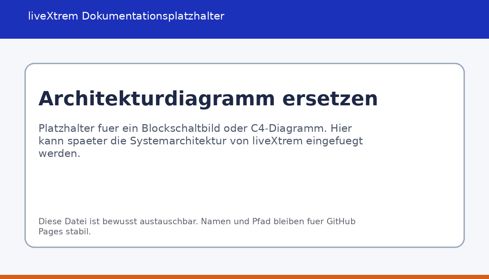
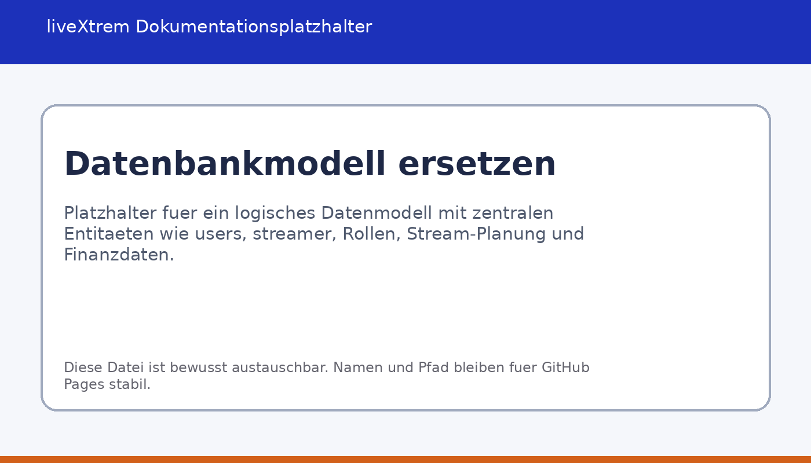

<link rel="stylesheet" href="assets/styles/custom.css">

<nav class="doc-nav">
  <a href="./">Start</a>
  <a href="installation/">Installation</a>
  <a href="setup/">Setup</a>
  <a href="architecture/">Architektur</a>
  <a href="api/">API & Code</a>
  <a href="user-guide/">User Guide</a>
  <a href="strategy/">Technische Strategie</a>
</nav>

# Architektur

<strong>Info:</strong> Diese Dokumentation ist für GitHub Pages aufgebaut. Bilder und Styles liegen bewusst in separaten Verzeichnissen, damit sie ohne Änderungen an den Markdown-Dateien ausgetauscht werden können.

## Architekturüberblick

liveXtrem ist als Desktop-Anwendung in Python umgesetzt und kombiniert eine grafische Oberfläche mit einer relationalen Datenhaltung und einer externen Twitch-Anbindung. Die Architektur folgt keinem monolithischen Ein-Fenster-Ansatz, sondern trennt den Einstieg in das System von den fachlichen Arbeitsbereichen. Dadurch können die unterschiedlichen Rollen im Streaming-Umfeld mit jeweils passenden Dashboards abgebildet werden.

<figure>
  
  <figcaption>Platzhalter für das Architekturdiagramm. Die Datei kann später durch eine finale Diagrammversion ersetzt werden.</figcaption>
</figure>

## Zentrale Komponenten

### Login und Session-Kontext

Der Einstieg erfolgt über `login.py`. Dort werden Benutzeranmeldung, Registrierung neuer Streamer und der Aufbau einer fachlichen Sitzung gebündelt. Nach erfolgreicher Authentifizierung entsteht ein `SessionUser`, der nicht nur die technische Identität des eingeloggten Benutzers hält, sondern auch den fachlichen Kontext, in dem spätere Dashboards arbeiten. Dieser Punkt ist für liveXtrem besonders wichtig, weil Streamer bei Rollenwechseln weiterhin im eigenen Kontext arbeiten sollen.

### Router und Dashboard-Auswahl

`router.py` entkoppelt die Anmeldung von der konkreten Zieloberfläche. Der Router entscheidet anhand der Rolle oder eines explizit übergebenen Zieltyps, ob das Streamer-, Moderator- oder Manager-Dashboard geöffnet wird. Damit bleibt die Einstiegsschicht schlank, während die Zustandslogik zentral gebündelt wird.

### Streamer-Dashboard

Das Streamer-Dashboard ist der umfangreichste Arbeitsbereich der Anwendung. Es vereint operative Funktionen wie To-do-Verwaltung, Streamplanung, Finanzbuchungen, Exportfunktionen und Teamverwaltung. Fachlich bildet dieses Modul das Zentrum der Anwendung, weil hier die meisten Daten erzeugt und gepflegt werden.

### Manager-Dashboard

Das Manager-Dashboard fokussiert sich auf koordinative Aufgaben. Im Mittelpunkt stehen Kalenderansichten, Termin- und Eventplanung sowie die Verwaltung zugeordneter Streamer. Die Daten werden nicht separat gepflegt, sondern aus dem gemeinsamen Datenbestand gelesen und rollenabhängig gefiltert. Dadurch bleibt die Informationsbasis konsistent.

### Moderator-Dashboard

Das Moderator-Dashboard verbindet die Desktop-Anwendung mit Twitch-nahen Moderationsprozessen. Es bietet eine Übersicht über Moderationsaktionen, einen Chat-Monitor auf Basis von VOD-Informationen und Oberflächen für Timeout-, Ban- und Unban-Vorgänge. Die Logik ist bewusst getrennt, weil hier neben Datenbankzugriffen auch externe API-Funktionen und Berechtigungen eine Rolle spielen.

### Datenbankschicht

Die relationale Datenhaltung wird über Datenbankmodule wie `database_connection.py`, `database_queries.py` und `database_queries_moderator.py` angebunden. Die Datenbank speichert unter anderem Benutzer, Rollen, Streamer-Profile, Teamzuordnungen, Planungsdaten, To-dos, Finanzinformationen und Twitch-bezogene Identitätsdaten. Auf diese Weise bleiben fachliche Informationen dauerhaft verfügbar und müssen nicht in lokalen Dateien pro Arbeitsplatz gepflegt werden.

### Twitch-Integration

Im Verzeichnis `fremdsys/` liegen die Module für OAuth und API-Kommunikation. `oauth.py` übernimmt den Browser-basierten Login und den lokalen Callback, während `tapi_data.py` und `tapi_mod.py` Fachfunktionen für Statistik-, VOD- und Moderationsdaten kapseln. Die Desktop-Anwendung muss dadurch die HTTP-Kommunikation nicht an mehreren Stellen selbst nachbauen.

## Zusammenspiel der Komponenten

Der typische Ablauf beginnt mit der Anmeldung eines Benutzers. Nach erfolgreicher Authentifizierung wird eine Session mit Rollen- und Kontextinformationen aufgebaut. Anschliessend öffnet der Router das passende Dashboard. Dieses Dashboard lädt die benötigten Daten aus der Datenbank und ergänzt sie bei Bedarf um Twitch-Daten. Änderungen, etwa an einem geplanten Stream oder an einer Finanzbuchung, werden wieder in die Datenbank zurückgeschrieben und stehen dadurch auch anderen Rollen im selben fachlichen Kontext zur Verfügung.

Aus architektonischer Sicht verfolgt liveXtrem damit einen klaren Grundsatz: Die GUI ist für Interaktion und Darstellung zuständig, während Persistenz und externe Integrationen in eigenen Modulen gekapselt werden. Das verbessert Nachvollziehbarkeit und Wartbarkeit gegenüber einer Vermischung aller Verantwortlichkeiten in einer einzelnen Datei.

## Datenmodell auf fachlicher Ebene

Die genaue Diagrammversion wird später ersetzt. Aus dem Quellcode lässt sich jedoch bereits ein stabiles Kernmodell ableiten. Zentrale Entitäten sind `users`, `user_roles`, `streamer`, `moderator`, `streamer_manager`, `streamer_moderator`, `stream_planung`, `streamer_finances`, `streamer_todos` und `twitch_tokens`. Diese Struktur zeigt, dass liveXtrem Benutzeridentität, Rollenlogik und fachliche Objekte bewusst trennt.

<figure>
  
  <figcaption>Platzhalter für das logische Datenbankmodell. Die finale Version sollte Entitäten, Schlüssel und relevante Beziehungen sichtbar machen.</figcaption>
</figure>

<strong>Tipp:</strong> Wenn später echte Screenshots oder Diagramme vorliegen, können die vorhandenen Platzhalterdateien einfach ersetzt werden, solange Dateiname und Pfad erhalten bleiben.

