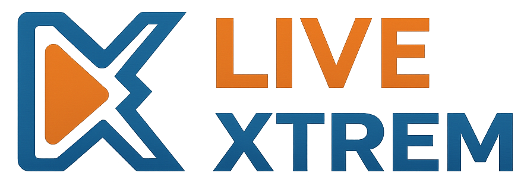

[Home](index.md) | [Installation](installation.md) | [Setup](setup.md) | [Technik](architecture.md) | [API](api.md) | [User Guide](user-guide.md) | [Strategie](strategy.md)

---

# liveXtrem

**liveXtrem** ist eine Softwarelösung für kleine bis mittelgroße Streamer zur zentralen Verwaltung von Contentplanung, Finanzen und Community-Rollen.  
Sie adressiert das Problem fehlender integrierter Tools für kleinere Creator und ermöglicht eine strukturierte Zusammenarbeit mit Moderatoren und Managern.  
Die Anwendung kombiniert organisatorische und administrative Funktionen in einer leicht zugänglichen Desktop-Lösung.

## Features
- Zentrale Verwaltung von Streaming-Inhalten
- Rollenbasierte Nutzung (Streamer, Moderator, Manager)
- Finanzübersicht und Planung
- Strukturierte Organisation von Aufgaben und Content

<a href="installation.md"><button>Zur Installation</button></a>
