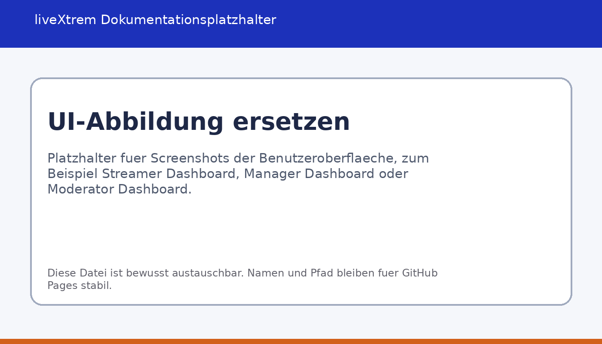

[Home](index.md) | [Installation](installation.md) | [Setup](setup.md) | [Technik](architecture.md) | [API](api.md) | [User Guide](user-guide.md) | [Strategie](strategy.md)

---

# User Guide

## Einstieg

Starten Sie die Anwendung über die Desktop-Verknüpfung.

## Hauptfunktionen

### Dashboard

### Content Planung
> 💡 **Tipp:** Inhalte strukturiert planen

### Finanzverwaltung
> ℹ️ **Hinweis:** Einnahmen und Ausgaben verwalten

## Beispiel
> ℹ️ **Hinweis:** [PLATZHALTER – Demo Szenario]
